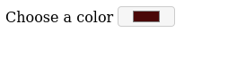

# Color Changer
## Add colors to a list and set the background on click

## Topics Covered
- [color input type](https://www.w3schools.com/TAGS/att_input_type_color.asp)
- [ul](https://www.w3schools.com/TAGS/tag_ul.asp) and [li](https://www.w3schools.com/TAGS/tag_li.asp) elements
- [create elements](https://www.w3schools.com/jsref/met_document_createelement.asp) and [add to DOM](https://www.w3schools.com/jsref/met_node_appendchild.asp) using javascript
- [set html](https://www.w3schools.com/jsref/prop_html_innerhtml.asp) of an element using javascript
- [this](https://www.w3schools.com/js/js_this.asp) keyword and how its value changes in [arrow functions](https://www.w3schools.com/Js/js_arrow_function.asp) ("What About this?" section)

## Steps
1. Create a directory named `color-changer` with files `index.html` and `script.js` (link the js file to the HTML file same as last time).
2. Add the `label` and color `input`.
3. Add an empty `ul` with an id or class.
4. In `script.js`, query the DOM for the color `input` and `ul` elements. Also grab the `body` for later.
5. Add a 'change' event listener to the `input` element with a callback function that takes the color value and adds it as a `li` to `ul`.
6. Add a 'click' event listener to the created `li` element with a callback function that uses the `this` keyword to access its html content, and sets this value as the body background (or use [dataset](https://developer.mozilla.org/en-US/docs/Learn/HTML/Howto/Use_data_attributes) to store/retrieve color value).

## Bonus
- Using CSS, make a pointer cursor when hovering over the `li`.
- Add a delete button to each `li` to remove it from the list.