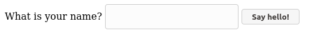
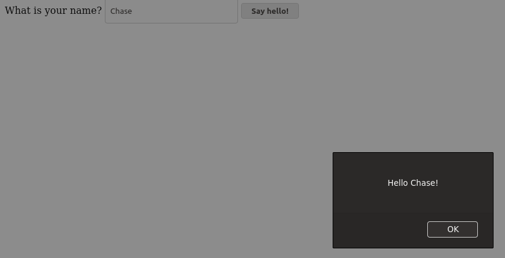

# Name Alert
## Type in your name and be greeted with an alert!

## Topics covered
- [input](https://www.w3schools.com/tags/tag_input.asp), [button](https://www.w3schools.com/tags/tag_button.asp) and [label](https://www.w3schools.com/tags/tag_label.asp) elements
- [DOM](https://www.w3schools.com/js/js_htmldom.asp) and getting DOM values using [javascript](https://www.w3schools.com/js/js_htmldom_methods.asp)
- [Events](https://www.w3schools.com/js/js_htmldom_events.asp) and [adding event listeners](https://www.w3schools.com/js/js_htmldom_eventlistener.asp)
- [alert](https://www.w3schools.com/js/js_popup.asp)
- [template literals](http://es6-features.org/#StringInterpolation)

## Steps
1. Create a directory named `name-alert` with files `index.html` and `script.js`.  Tip: in an empty `index.html` file, do shortcut ! + tab to quickly stub out html file.
2. Add a reference to `script.js` just above the closing body tag.
3. Add an alert or console log in `script.js` to be sure the file is linked properly. You can remove this afterward.
4. Add the `label`, `input`, and `button` elements to `index.html`.
5. In `script.js`, query the DOM for the `input` and `button` elements.
6. In `script.js`, add a click event listener to the `button` element with a callback function. This function will get the `input` value and place it in an alert using a template literal string.

## Bonus
- Display a custom string if no value was entered.
- Trim the whitespace before and after the string.